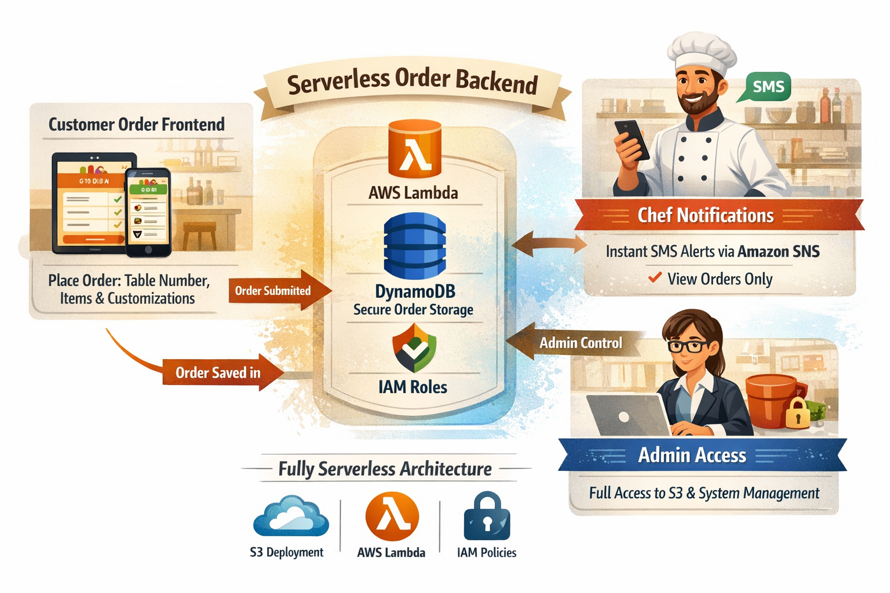

# ☕ Cafe Management System – AWS Lambda Backend

---

## 🚀 Project Overview
A **serverless backend system** to manage cafe orders in real-time.  
Users place orders via a frontend, orders are saved in **DynamoDB**, and chefs receive **SMS notifications instantly via SNS**.  

Key features:
- Place orders with table number, items, and customizations.
- Orders stored securely in DynamoDB.
- Real-time SMS notifications to chefs via SNS.
- Fully **serverless architecture** using AWS Lambda and IAM roles.

---

## 🛠️ Tech Stack & Services

| Service        | Purpose                                      |
| -------------- | -------------------------------------------- |
| **AWS Lambda** | Backend order handler                        |
| **DynamoDB**   | Stores all order records                     |
| **SNS**        | Sends SMS notifications to chefs             |
| **IAM Roles**  | Grants Lambda permissions for DynamoDB & SNS |

---

## 📦 Data Structure (DynamoDB)

| Attribute   | Type   | Description              |
| ----------- | ------ | ------------------------ |
| orderId     | String | Unique ID for each order |
| tableNumber | String | Table number             |
| items       | String | Items ordered            |
| custom      | String | Customizations           |
| total       | Number | Order total              |
| timestamp   | String | ISO timestamp of order   |

---

## 🔧 Environment Variables

| Variable Name   | Description                          |
| --------------- | ------------------------------------ |
| `DYNAMO_TABLE`  | DynamoDB table name (`CafeOrders`)   |
| `SNS_TOPIC_ARN` | SNS topic ARN for chef notifications |

---

## 📱 SNS Configuration
- **Topic Name:** `sns-for-sms`
- **Message Example:**
🍽️ New Order #1234 - Table 5
Items: Masala Dosa x2, Soda x1
Custom: Extra Spicy
Amount: ₹150

---

## 🧩 Step-by-Step Setup Guide (For New Users)

> 🧠 *Follow these simple steps to build and configure the AWS Lambda backend for your Cafe Management System — even if you're new to AWS!*

---

### 🏗️ **Step 1: Create a DynamoDB Table**

1. Go to **AWS Console → DynamoDB → Create Table**  
2. **Table name:** `CafeOrders`  
3. **Partition key:** `orderId` *(String)*  
4. Keep other settings as default and click **Create Table** ✅  

📘 *This table will store all order details securely in the cloud.*

---

### ⚙️ **Step 2: Create an SNS Topic**

1. Open **AWS Console → SNS → Topics → Create Topic**  
2. Choose **Standard** type  
3. **Topic name:** `sns-for-sms`  
4. Click **Create Topic**  
5. Under **Subscriptions**, add your **phone number** to receive order alerts via SMS.  
6. Confirm your subscription through the verification SMS.  

📩 *This will instantly notify chefs when new orders arrive!*

---

### 🧠 **Step 3: Create the Lambda Function**

1. Go to **AWS Console → Lambda → Create Function**  
2. Choose **Author from scratch**  
 - **Function name:** `CafeOrderHandler`  
 - **Runtime:** `Python 3.x`  
3. Under **Permissions**, create a **new role** with basic Lambda permissions.  
4. After creation, open your function and paste your **Lambda code** that:  
 - Saves orders to **DynamoDB**  
 - Triggers **SNS notifications** to chefs  
5. Navigate to **Configuration → Environment Variables**, then add:
 | Key | Value |
 | --- | ------ |
 | `DYNAMO_TABLE` | `CafeOrders` |
 | `SNS_TOPIC_ARN` | *(Your SNS Topic ARN)* |

💡 *These environment variables let Lambda know where to store data and send notifications.*

---

### 🔐 **Step 4: Add IAM Permissions**

1. Go to **IAM → Roles → [Your Lambda Role] → Add Permissions**  
2. Attach these **AWS managed policies:**
 - `AmazonDynamoDBFullAccess`
 - `AmazonSNSFullAccess`
 - `AWSLambdaBasicExecutionRole`  

🛡️ *This ensures Lambda has permission to interact with DynamoDB and SNS securely.*

---

### 🔁 **Step 5: Add Lambda Destination (For Monitoring)**

You can set up a **Lambda destination** to automatically log successful or failed executions.

1. Go to **Lambda → Configuration → Destinations**  
2. Under **Asynchronous invocation**, choose:
 - **On success:** Select your **SNS topic** (to confirm successful order notifications)  
 - **On failure:** Select an **SQS queue** or another **SNS topic** (for error alerts)  
3. Click **Save** — now Lambda automatically tracks and reports results of every execution.

✅ *Now your system is fully connected:*
- Lambda stores orders in DynamoDB  
- Sends SMS to the chef via SNS  
- Logs success or failure using Destinations  

---

## 🔐 IAM Roles & Policies
**Role Name Suggestion:** `CafeOrdersLambdaRole`  

**Required Policies:**  
- `AmazonDynamoDBFullAccess` (or least privilege: PutItem on CafeOrders)  
- `AmazonSNSFullAccess` (or least privilege: Publish to SNS)  
- `AWSLambdaBasicExecutionRole`

---

## 🗂️ Folder Structure

 cafe-management-system/
│
├─ lambda/
│ └─ cafe_order_lambda.py
├─ frontend/
│ └─ index.html
└─ README.md 

---

## 🌟 Contributors

- **Trupti Mane Ma’am** – ⭐ AWS wizard & hands-on support, made testing and deployment seamless! [iamtruptimane](https://github.com/iamtruptimane)  
- **Shivam Garud** – DevOps & Cloud Engineer  

---

## 🔗 Links & Contact

**GitHub:** [shivamgarud8](https://github.com/shivamgarud8)  
**LinkedIn:** [Shivam Garud](https://www.linkedin.com/in/shivam-garud-371b5a307)

---

## 📸 Project Snapshots

---
👩‍🏫 **Guided and Supported by [Trupti Mane Ma’am](https://github.com/iamtruptimane)**  
---

👨‍💻 **Developed By:**  
**Shivam Garud**  
🧠 *DevOps & Cloud Enthusiast*  
💼 *💼 DevOps Engineer | CI/CD | Docker | Kubernetes | Terraform | Ansible | AWS | Linux | Cloud Automation | Infrastructure as Code!*  
🌐 [GitHub Profile](https://github.com/Shivamgarud8)
🌐 [Medium blog](https://medium.com/@shivam.garud2011)
🌐 [linkedin](www.linkedin.com/in/shivam-garud)
🌐 [portfolio](https://shivam-garud.vercel.app/)

